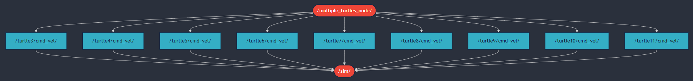
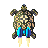
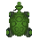

# `var_n7k_beadando` package
ROS 2 python package.  [](https://docs.ros.org/en/humble/)

A package egy node-ból áll, amely a turtlesim szimulátorban képes egy céltábla kirajzolására. Megvalósítás ROS 2 Humble alatt.

This package consists of one node. The aim of the node is to draw an archery target in the turtlesim simulator. This package builds in ROS 2 Humble.
## Packages and build

It is assumed that the workspace is `~/ros2_ws/`.

### Clone the packages
``` r
cd ~/ros2_ws/src
```
``` r
git clone https://github.com/samuvarga/var_n7k_beadando
```

### Build ROS 2 packages
``` r
cd ~/ros2_ws
```
``` r
colcon build --packages-select var_n7k_beadando --symlink-install
```

<details>
<summary> Don't forget to source before ROS commands.</summary>

``` bash
source ~/ros2_ws/install/setup.bash
```
</details>

``` r
ros2 launch var_n7k_beadando archery_target_launch.py
```
## Visualization

### Archery Target Visualization


### Graph

The `/multiple_turtles_node` node publishes multiple `/turtleX/cmd_vel` topics , where `X` ranges from 3 to 11. The simulator node (`/sim`) subscribes to these command topics.



## Challenges

A turtlesim alkalmazásban a teknősök textúráját módosítani kellett, mert az eredeti 48×48 pixeles képek helyett 45×45 pixeles textúrákra volt szükség. A méretkülönbség miatt a teknősök mozgásuk során nem rajzoltak koncentrikus köröket.

A probléma megoldásához a galactic és rolling nevű teknős textúrákat ardent nevű textúrára cseréltem, amely megfelelő méretű, így biztosítva a pontos rajzolást.

In the turtlesim application, the turtle textures had to be modified because the original 48×48 pixel images needed to be replaced with 45×45 pixel textures. Due to the size difference, the turtles did not draw concentric circles during their movement.

To solve this issue, I replaced the galactic and rolling turtle textures with the ardent texture, which has the correct size, ensuring accurate drawing.

|  |  |  |
|:-----------------------------:|:---------------------------:|:-------------------------:|
| Galactic                      | Rolling                     | Ardent                    |
